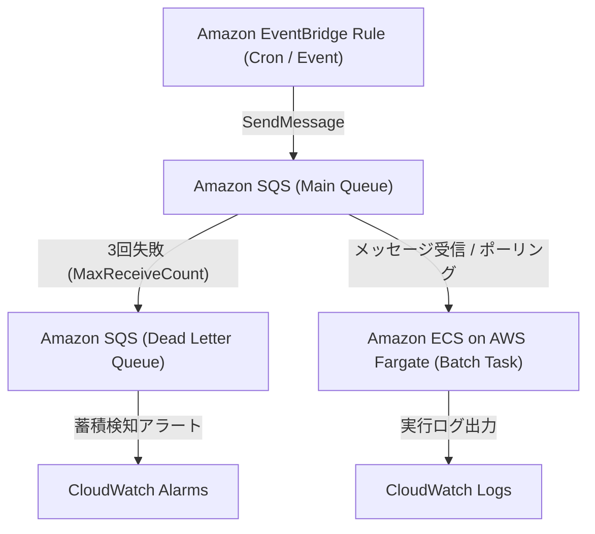

# Event-Driven Batch IaC (Terraform & AWS CDK)

Amazon EventBridge、Amazon SQS、および Amazon ECS on AWS Fargate を組み合わせた、堅牢で疎結合なイベント駆動型サーバーレスバッチ基盤の IaC リポジトリです。
本プロジェクトは宣言型アプローチの **Terraform** と、プログラミング言語アプローチの **AWS CDK** の「二刀流」で同一アーキテクチャを完全再現しています。

---

## 🌟 インフラの特長と設計ポイント

- **疎結合 & 自動リトライ**: EventBridge 起点で SQS にキューイング。急激なトラフィックや処理スパイクを吸収します。
- **堅牢な耐障害性**: メインキューで3回失敗したメッセージは自動的にデッドレターキュー（DLQ）へ隔離し、メッセージ欠損を完全防止。
- **完全サーバーレスコンピューティング**: コンテナタスクは AWS Fargate 上のプライベートサブネットで実行。ホスト管理が不要でスケーラブル。
- **最小権限セキュリティ**: タスク実行ロールとタスクロールを厳格に分離し、KMS による保管時暗号化を標準適用。
- **二刀流 IaC**: `terraform/` と `cdk/` で同一リソース命名規約・タグ付けポリシーを共有し、チームのスキルセットや検証用途に応じた選定が可能。

---

## 📐 インフラ構成図



---

## 📁 ディレクトリ構造

```text
.
├── terraform/                # Terraform 実装 (HCL)
│   ├── main.tf               # プロバイダ設定・バックエンド
│   ├── eventbridge.tf        # EventBridge ルール・ターゲット
│   ├── sqs.tf                # メインキュー & DLQ 設定
│   ├── ecs.tf                # ECS クラスタ・タスク定義・Fargate 設定
│   ├── iam.tf                # IAM ロール・最小権限ポリシー
│   └── variables.tf          # 入力パラメータ定義
├── cdk/                      # AWS CDK 実装 (TypeScript)
│   ├── bin/
│   │   └── batch-app.ts      # CDK アプリエントリポイント
│   ├── lib/
│   │   └── batch-stack.ts    # L2/L3 コンストラクトによるスタック実装
│   ├── cdk.json
│   ├── package.json
│   └── tsconfig.json
└── README.md
```

---

## 🚀 展開手順

環境や検証方針に合わせて、Terraform または AWS CDK のいずれかを選択してデプロイできます。

### Terraform によるデプロイ

```bash
cd terraform
terraform init
terraform plan
terraform apply
```

### AWS CDK によるデプロイ

```bash
cd cdk
npm install
npx cdk diff
npx cdk deploy
```

---

## 🎭 キャスト（制作クレジット）

AIアプリ工場劇場の精鋭エージェントチームによって企画・構築・品質検証が行われました。

- agent🔵 : 要件定義・システムアーキテクチャ設計
- agent🍇 : 進行管理・デザインレビュー
- agent🍊 : IaC コード爆速実装（Terraform & CDK 二刀流構築）
- agent🟢 : インフラ品質検証・セキュリティ監査・Lint 検証
